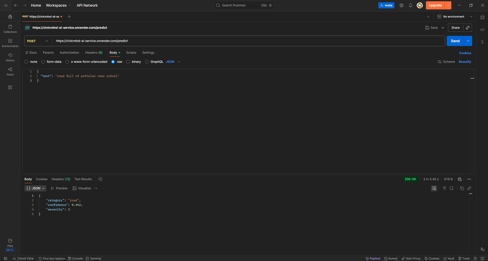

CivicMind – AI-Based Civic Complaint Classification System

CivicMind is an NLP-based machine learning project that classifies civic complaints into predefined categories and assigns a severity level for prioritization.

This project demonstrates an end-to-end ML pipeline: dataset creation, preprocessing, feature engineering, model training, evaluation, API development, and cloud deployment.

🔹 Objective

To automatically classify civic complaints into one of the following categories:

 - Water
 - Sanitation
 - Road
 - Streetlight
 - Waste

Each category is mapped to a fixed severity level (1–5) to help prioritize issues.

🔹 Severity Mapping
BASE_SEVERITY = {
    "water": 1,
    "sanitation": 2,
    "road": 3,
    "streetlight": 4,
    "waste": 5
}

🔹 Dataset

 - Custom dataset created manually
 - 5 balanced categories
 - English + Hinglish complaints
 - Cleaned and preprocessed before training

Example:

"pani kal se nahi aa raha" → water  
"road full of potholes" → road  
"kachra har jagah pada hai" → waste

🔹 ML Pipeline
1️⃣ Text Cleaning

 - Lowercasing
 - Removing punctuation and special characters
 - Whitespace normalization

2️⃣ Feature Engineering

 - Word-level TF-IDF (1–3 n-grams)
 - Character-level TF-IDF (3–5 n-grams)
 - Combined sparse matrix features

3️⃣ Model

 - Logistic Regression
 - Class balancing enabled
 - Stratified 5-Fold Cross Validation

🔹 Model Performance

 - Mean Cross Validation Accuracy: ~67%
 - Test Accuracy: ~73%
 - Balanced evaluation using classification report

This model is designed for practical deployment rather than perfect academic accuracy.

🔹 API Development
 - Built using Flask.

Endpoint:
POST /predict

Example Request:
{
  "text": "road full of potholes near school"
}

Example Response:
{
  "category": "road",
  "confidence": 0.81,
  "severity": 3
}

🎯 Test Accuracy: 0.7333

📄 Classification Report:

              precision    recall  f1-score   support

       waste       1.00      0.83      0.91         6
        road       0.60      0.50      0.55         6
  sanitation       0.71      0.83      0.77         6
 streetlight       0.60      0.50      0.55         6
       water       0.75      1.00      0.86         6

🔹 Deployment
 - The model is deployed publicly using Render.

Try the deployed API here:
https://civicmind-ai-service.onrender.com/predict

🔹 Tech Stack

 - Python
 - Scikit-learn
 - TF-IDF
 - Logistic Regression
 - Flask
 - Joblib
 - Render (Deployment)

🔹 What I Learned

 - Building a clean ML training pipeline
 - Avoiding data leakage
 - Feature engineering with word + character n-grams
 - Cross-validation and model evaluation
 - Deploying ML models as REST APIs
 - Debugging production errors (500, 405, model loading issues)

🔹 Future Improvements

   - Expand dataset size
   - Add multilingual support
   - Add model monitoring
   - Explore transformer-based models (BERT)

👨‍💻 Author

    Dev Patmase
    AI/ML Enthusiast | Aspiring ML Engineer